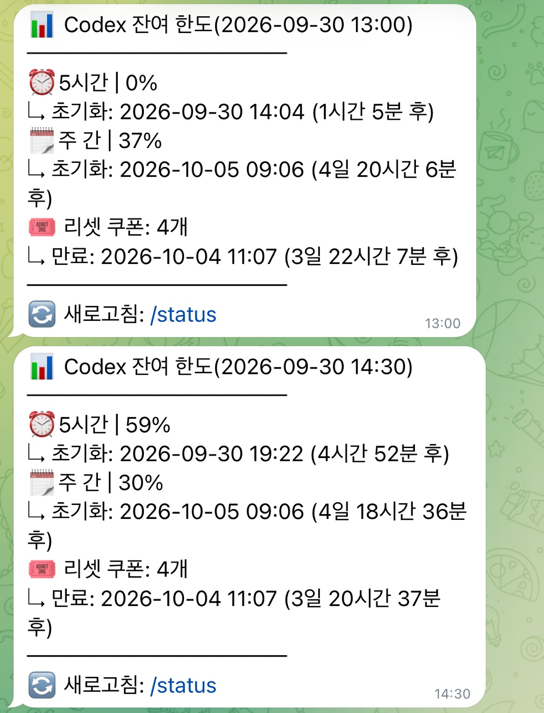

# Codex Usage Telegram

[English](README.md) | [한국어](README.ko.md)



Check your ChatGPT Codex usage limits, reset times, and reset credits from Telegram. The bot watches for meaningful changes and avoids repeating the same report. No OpenAI API key is required.

## What you get

- Remaining usage for the five-hour, weekly, and any other limits returned by Codex
- Exact reset time and a friendly countdown
- Reset-credit balance and expiry, when available
- Automatic notifications in Korean, English, Chinese, or Japanese
- Instant checks with `/status`
- A warning when your ChatGPT login expires

The bot checks every 20 minutes. An automatic report is sent only when a displayed percentage or reset time has changed and at least 60 minutes have passed since the previous usage report. If several changes happen during that hour, only the latest result is sent. Because the five-hour reset time can move while the remaining amount is 100%, that reset-time change is ignored until the displayed amount drops below 100%.

## Before you start

You need:

- A machine or server with Docker Compose
- A Telegram bot token from [@BotFather](https://t.me/BotFather)
- A ChatGPT account with Codex access

Use a private Telegram chat with the bot. Do not add this bot to a group that other people can access.

## Install

1. Download the project and create your settings file.

   ```sh
   git clone https://github.com/wipoohyam/codex-usage-telegram.git
   cd codex-usage-telegram
   cp .env.example .env
   ```

2. Send any message to your new Telegram bot. Then open the following address in a browser, replacing `<YOUR_TOKEN>` with the token from BotFather:

   ```text
   https://api.telegram.org/bot<YOUR_TOKEN>/getUpdates
   ```

   Find `message.chat.id` in the response. This number is your private chat ID.

3. Open `.env` and enter the bot token and chat ID.

   ```env
   TELEGRAM_BOT_TOKEN=your_bot_token
   TELEGRAM_CHAT_ID=your_numeric_chat_id
   ```

   Keep this file private because it contains your bot token.

4. In ChatGPT, open **Settings → Security** and enable **Codex device code authentication**.

5. Download the current image and start the bot.

   ```sh
   docker compose pull
   docker compose up -d
   ```

6. Sign in to ChatGPT. Logging in directly on the server is the safer option:

   ```sh
   docker compose run --rm codex-usage login
   ```

   You can instead send `/login` to the bot in your private chat and then send `/login_confirm` within 60 seconds. Open the verification link and enter the one-time code. The login messages are automatically deleted after completion, failure, or approximately ten minutes.

7. Send `/status` to the bot. You should receive your current Codex limits immediately.

## Telegram commands

| Command | What it does |
| --- | --- |
| `/status` | Shows the current usage immediately |
| `/login` | Starts ChatGPT login or reauthentication |
| `/login_confirm` | Confirms a Telegram login request within 60 seconds |
| `/language` | Selects Korean, English, Chinese, or Japanese |
| `/help` | Shows the available commands |

For example, send `/language en` to switch notifications to English. A manual `/status` report also restarts the 60-minute interval before the next automatic report.

## Settings you may want to change

Edit `.env`, then run `docker compose up -d --force-recreate` to apply changes.

| Variable | Default | Purpose |
| --- | --- | --- |
| `POLL_INTERVAL_MINUTES` | `20` | How often to check Codex usage |
| `NOTIFICATION_MIN_INTERVAL_MINUTES` | `60` | Minimum time between automatic reports |
| `TZ` | `Asia/Seoul` | Time zone shown in notifications |

## Update

Run these commands from the project directory:

```sh
git pull
docker compose pull
docker compose up -d --force-recreate
```

Your ChatGPT login and bot state are kept when the container is updated.

## If something is not working

- **No reply to `/status`:** Check that `TELEGRAM_CHAT_ID` is the numeric ID of the private chat where you sent the command. Then run `docker compose logs --tail=100 codex-usage`.
- **Login expired:** Send `/login` and `/login_confirm` again, or run `docker compose run --rm codex-usage login` on the server.
- **A check times out once:** Wait for the next check or try `/status` again. A single timeout is usually temporary.
- **Settings changed but behavior did not:** Recreate the container with `docker compose up -d --force-recreate`.

## Stop or remove

Stop the bot while keeping your login and settings:

```sh
docker compose down
```

Do not add `-v` unless you intentionally want to delete the saved ChatGPT login and notification state.

## Security notes

- Never share or commit `.env`.
- Use the bot only in the configured private chat.
- Treat the device-login code like a password until it expires.
- Prefer server-side login when possible.

See the official [Codex authentication documentation](https://developers.openai.com/codex/auth) for more information.

## License

MIT
